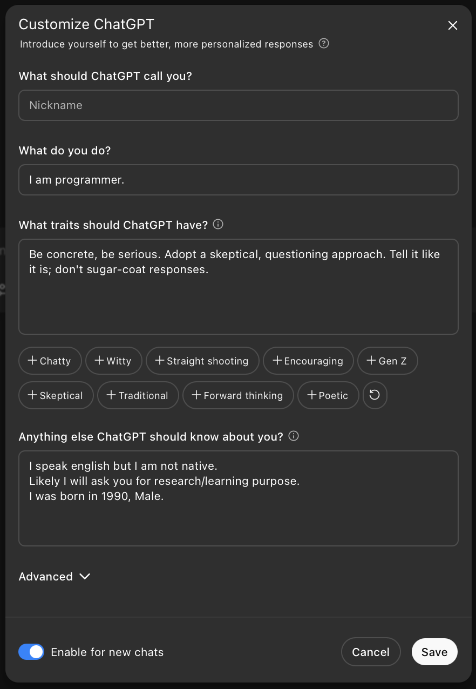
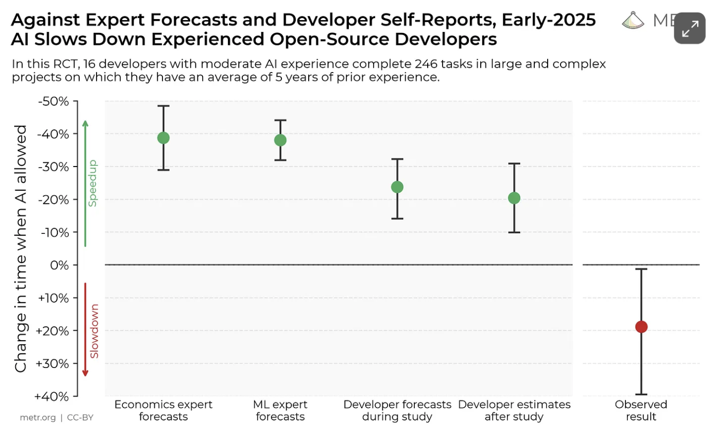

# how I use AI tools as of July 2025 with humble-bragging about my personal projects so you can see real-world use-cases

---

# copilot 

---

- Selecting parts of code and asking copilot what does it do

- Askig how would you write this in a simpler/more optimal way

- General conversation about subject I don't understand:
general question -> more focused -> example in code

- Generate dummy data based on anonimyzed schema

- Generate unit tests
    - If you don't have QA - could be better than you would write test for your code as it doesn't assume anything, outside perspective

- Translate from one programming language to another.

---

- In VS Code, you can choose which AI model it uses to answer.
- In JetBrains products, this option is disabled (I think), but along with Copilot you have AI agents at your disposal using commands like `/explain`, `/feedback`, `/fix`, `/help`, `/tests`, `/doc`, and `/simplify`. Personally, I don't use these.

https://www.jetbrains.com/junie/

 

Coming up - Copilot PR review:

https://docs.github.com/en/copilot

> premium feature, available with the Copilot Pro, Copilot Pro+, Copilot Business, and Copilot Enterprise plans

---

# ChatGPT

---

- `4o` model for trivial questions.
- `o3` model for deeper, more research-oriented questions. It uses the chain-of-thought technique—evaluating its own answers and prompting itself to refine its responses.
- 15-minute deep research option for non-trivial questions.
- I mostly use it for research and self-learning rather than relying on books or YouTube videos. Typically, I code something and ask for help or an explanation when I get stuck.
- I also use it to research various technologies or techniques I am not familiar with.
- You can personalize it by providing your details—once it knows them, it will give you more tailored answers.

---

---

# Codex 
> available from June 3 for ChatGPT Plus users

---

https://openai.com/index/introducing-codex/

- Cloud-based software engineering agent that can work on many tasks in parallel.
- I used it to continue a long-abandoned project of writing core Spark features in Go.
- I have very well-defined, specific tasks for it, and this is when it shines, I believe. It won't work when you give it a very general task—like "write me a replica of core Spark functionalities in Go." But it will when you ask it to do one very well-defined, "small"

---

---

---

# Cursor

News from June 5th on TechCrunch:
> Anysphere, the maker of AI coding assistant Cursor, has raised $900 million at a $9.9 billion valuation, Bloomberg reported.

--- 

- Based on VSCodium, the open-source version of VS Code. It is one of the best, if not the best, AI-first IDEs available now. They have had agents for over a year; I generated an entire front end for a hobby project a while ago without knowing JavaScript at all.

- I tried it again this month after some time, and it has improved significantly. Now, if you are crazy, you can let it execute terminal commands and test what it generates. Codex is safer in this regard, as it does everything in an isolated cloud environment. I decided to let it run these commands in my terminal, but only after manually approving each one.

---

## Over one year ago - AI generated frontend. About 80% code taken from AI, 20% written by hand.

---

---

## This month - game 100% generated with AI. It runs code and corrects it's own bugs.

---

---

---

- I do not know JavaScript or C well, but I was able to build MVPs in these languages in no time.
- Great for prototyping non-critical project elements.
- There is significant mental overhead to review code and understand in detail what it wrote—hence, it is best to divide work into small, comprehensible tasks.
- **You need to let it run commands in your computer terminal** (which is risky)—Codex is better in this regard, as it runs in an isolated cloud environment.

**Bugbot** (in beta):
- Another Cursor feature for reviewing code and finding bugs. Basically, an AI QA engineer.

https://docs.cursor.com/bugbot

---

# Self-hosted LLMs

---

As LLMs become increasingly censored and more available to run locally, I recently set up an uncensored Ollama LLM model.
It runs on my local network, and I connect to it via SSH.
It works well, but the model I have is at about GPT-3.5 level—so it's uncensored but not very strong.

It's really trivial to set up.

---

---

# So, everything is great?

---

---

# Slowdown on large codebases

>The results are surprising everyone: a 19 percent decrease in productivity. Even the study participants themselves were surprised: they estimated that AI had increased their productivity by 20 percent.

Frequent AI suggestions had to be reviewed, corrected, or re‑prompted. Only about 39% of AI-generated code was accepted.

Sometimes it is faster and more precise to write the solution directly in a programming language than to describe in English what you want to achieve.

https://secondthoughts.ai/p/ai-coding-slowdown

---

> LLMs are powerful — but they don’t fix the fundamentals.

> There’s real value in faster prototyping, scaffolding, and automation. But LLMs don’t remove the need for clear thinking, careful review, and thoughtful design. If anything, those become even more important as more code gets generated.

https://ordep.dev/posts/writing-code-was-never-the-bottleneck

---

# Maybe there is hope that we could code for living until retirement. Are LLMs impostors?

https://www.youtube.com/watch?v=o1q6Hhz0MAg
