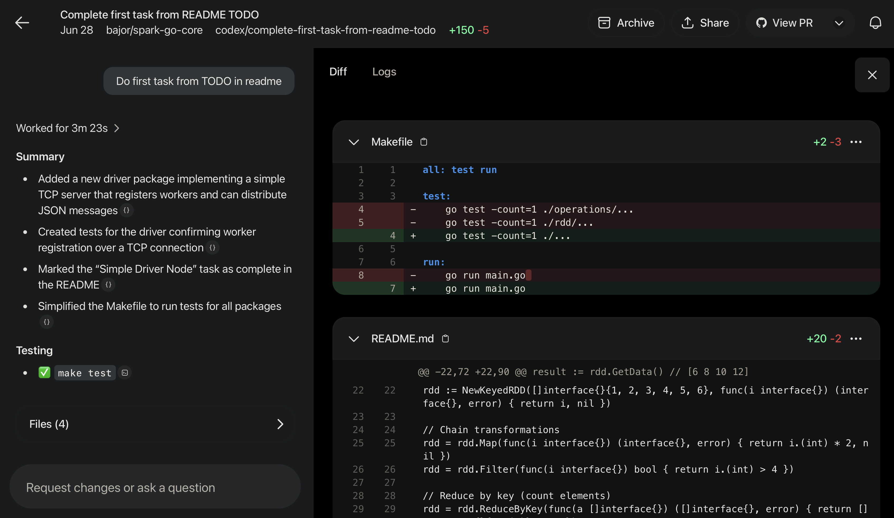
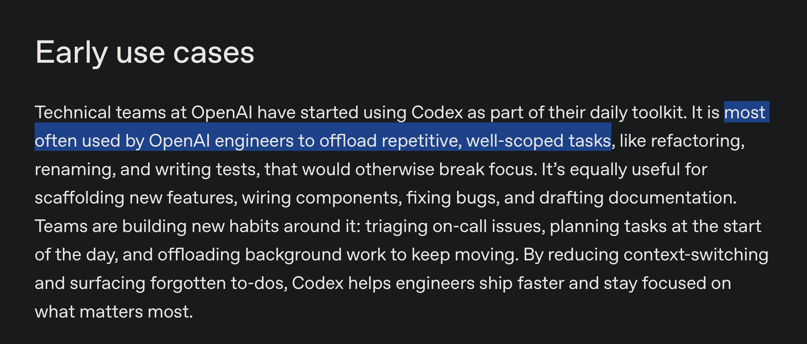

TODO:
- check spelling
- rewrite to be more clear


# Short presentation about how I use AI tools as of Jul 2025 with humble-bragging about my personal projects so you can see real-world use-cases. 

---

# copilot 

---

- I don't like code completions. It requires to be detail-oriented and write very precise function names - then it will generate likely what you need. For me it's distracting so I have it disabled.

- Selecting parts of code and asking copilot what does it do:
<example>

- Askig how would you write this simpler/more optimal:
<example>

- General conversation about subject I don't understand:
general question -> more focused -> example in code

- Generate dummy data:
<give this prompt, note that ``` because they oftern use markdown for reply>

- Generate unit tests - if you don't have QA - could be better than you would write test for your code as it doesn't assume anything, outside perspective

- Translate from one programming language to another.

---

- In vs-code you can choose model it will use to answer.
- In jetbrains products this option is disabled (I think) but it as these agents of `\explain` <add what else is avaliable> 
https://www.jetbrains.com/junie/

Comming up:
- Copilot to review PR:
https://docs.github.com/en/copilot
`
> premium feature, available with the Copilot Pro, Copilot Pro+, Copilot Business, and Copilot Enterprise plans

---

# chat gpt

---

- I have it as a default website in my private computer, I am addicted to it and use it daily instead of a google - for personal things.
- 4o model for trivial questions - how to boil egg
- o3 - for deeper, more reseach oriented - question. Uses chain of thought technique - it evaluates it's own answers and prompts itself to refine response.
- 15 deep reseach option for non-trivial questions 
- I use it for reseach mostly and to learn myself rather than from books or youtube videos. I usually code something and ask it for help or to explain some subject when I am stuck.
- tip - personalize it - tell him that for example you are python coder form poland <SHOW HERE SCREENSHOT> - once it nows that it will give you more tailored answers.
- can use it just by speaking to it and have live conversation. Perhaps good for learning foregin langauges.

---

# codex 

available from June 3 for ChatGPT Plus users

---

https://openai.com/index/introducing-codex/

- cloud-based software engineering agent taht can work on many task in parallel.
- used it to continue long-abandoned project of writing spark features in go.
- I have very defined, specific tasks for him and this is when it shines I believe. It won't work when you give it very general task - "write me replica of core spark funcitonalities in go". But it will when you ask him to do one very well defined "small" task. 

---



---



---

# cursor
news from 5th of June on techcrunch:
> Anysphere, the maker of AI coding assistant Cursor, has raised $900 million at a $9.9 billion valuation, Bloomberg reported.

--- 

- based on vscodium - open-sourced versin of vscode. One for best if not best AI-first IDE now. They had agents at least from over year, I've generated entire front-end for some hobby project while ago now knowing js at all:
https://www.youtube.com/watch?v=3F9TdbzjDdE
- I've tried it again this month after a while. It got way better. Now if you are that crazy you can let it execute terminal commands and let it test what it generated. Codex is safer in this regard as it does everything in isolated cloud environment. But I thought yolo and let it run these commands in my terminal but after me approving by hand each of them.

---


---


---


---

- I do not know well java script or C and was able to build MVPs in these langauges in no time.
- Great for prototyping of non-critical project elements.
- There is massive mental overhead to review code and undestand in detail what it wrote - hance best to divide it into small comprehendable tasks.
- **You need to let it run your computer terminal** (which is crazy) - codex is better in this regard as it runs in isolated cloud env

Bugbot in beta:
- other cursor feature for reviewing code and finding bugs. Basically AI QA engineer.
https://docs.cursor.com/bugbot

---

# self-hosted LLMs

---

as LLMs are more and more censoured and more and more available to run them locally I've setup not so long ago ollama uncensoured llm model. Have it in my local network, connect to it via ssh. Works well but the one I have it's gpt 3.5 level - so it's not censourded but not super strong either.

TODO: how easy it is to install it

- trivial to setup

---


---

# so no issues, all great?

---

**Short, based article:**
https://ordep.dev/posts/writing-code-was-never-the-bottleneck

> LLMs are powerful — but they don’t fix the fundamentals.
> There’s real value in faster prototyping, scaffolding, and automation. But LLMs don’t remove the need for clear thinking, careful review, and thoughtful design. If anything, those become even more important as more code gets generated.

**If you don't undestand code it generated - don't use it**

Not good for:
- system design
- complex logic - easier to describle problem in preceise programming language then in vague english

Be awere of **confimation bias**. AI will often agree with you even if you are not right!

For production ready systems:
- You must fully understand what you are doing.
- I find it most valuable in learning and then doing work by myself in better/more optimal/efficient way.
- I almost never copy paste 1:1 AI code.

---

# maybe there is hope that we could code for living until retirement

---

https://www.youtube.com/watch?v=o1q6Hhz0MAg


---
